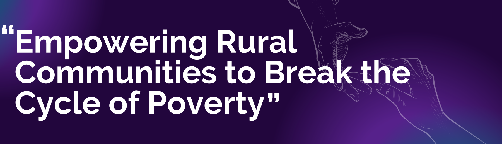

<div align="center">
  <br />
    <a href="/" target="_blank">
      
    </a>
  <br />
</div>

## Table of Contents
1. [Introduction](#introduction)
2. [Problem Statement](#problem-statement)
3. [Solution](#solution)
4. [Our Target SDG Goals](#our-target-sdg-goals)
5. [About the Project](#about-the-project)
6. [Our Mission](#our-mission)
7. [Why This Matters](#why-this-matters)
8. [What We Do](#what-we-do)
9. [Free Food Finder](#free-food-finder)
10. [Tech Stack](#tech-stack)
11. [Join Us](#join-us)
12. [Social Media](#social-media)
13. [Future Development](#future-development)
14. [About Us](#about-us)
15. [Setup](#setup)

## <a id="introduction"></a> Introduction

In a world abundant with resources yet marked by unequal distribution, countless individuals continue to face hunger and poverty. At the same time, rising food and clothing waste contributes to environmental damage and represents missed opportunities to support those in need. This imbalance is what inspired us to create Wall of Humanity—a platform committed to connecting donors with underserved communities, promoting sustainability and compassion.

Wall of Humanity is more than just a platform; it's a movement aimed at breaking the cycle of poverty, particularly in rural areas. By redistributing surplus food, clothing, and essential goods, we strive to offer immediate relief while fostering long-term empowerment. Our platform bridges the gap between those who have resources to share and those in need, ensuring that no valuable resource goes to waste.

## <a id="problem-statement"></a> Problem Statement 🎯
<div align="center">
  <br />
    <a href="/" target="_blank">
      
    </a>
  <br />
</div>

In many rural areas, people face a persistent struggle to meet basic needs like food, clothing, and essential supplies. Meanwhile, surplus resources in urban regions often go to waste. The lack of a bridge between donors and those in need prevents effective redistribution of these resources, keeping rural families trapped in poverty.

## <a id="solution"></a> Solution 💡

Wall of Humanity provides an innovative, user-friendly platform that connects donors, social workers, and people in need — ensuring surplus resources are efficiently redistributed to rural communities.

## <a id="our-target-sdg-goals"></a> Our Target SDG Goals 🎯
<div style="display: flex; justify-content: space-between; align-items: center;">
  
  
</div>

Our goal is to reduce food waste by redistributing surplus resources and providing essential items to those in need, fostering a more sustainable and equitable community.

## <a id="about-the-project"></a> About the Project ℹ️

**Welcome to Wall of Humanity!**

Our platform is designed to tackle two major issues: food and poverty. We believe in the power of community and sustainability, so we've created a space where people can donate items they no longer need, like clothes and food, to help those who truly need them. By connecting donors, social workers, and NGOs, we ensure that these items find their way to the people who need them most. People can join us as volunteers to help us.

## <a id="our-mission"></a> Our Mission

At **Wall of Humanity**, our mission is simple: reduce waste and empower communities. We're here to help break the cycle of poverty by redistributing surplus resources to those in need, especially in rural areas. Together, we can build a more sustainable and compassionate world.

## <a id="why-this-matters"></a> Why This Matters

- **Food Waste Crisis**: According to the Food and Agriculture Organization (FAO), approximately one-third of all food produced globally is wasted, while millions go hungry every day.
- **Clothing Waste**: The fashion industry contributes significantly to landfill waste, yet many individuals struggle to access basic clothing.
- **Rural Poverty**: Rural communities often lack access to resources, leaving them trapped in cycles of poverty and limited opportunities.

## <a id="what-we-do"></a> What We Do 📝

### How Donations Work
- **Donors**: If you have clothes, food, or other essentials you no longer need, simply sign up and list them on our platform.
- **Collection & Distribution**: Our team works to collect and distribute items to people or NGOs that can reach those in need.

### Sustainability at the Core
We reduce waste by giving items a second life, helping those in need while contributing to a sustainable future.

### Impact on Communities 🌍
Our project helps people focus on education and healthcare by providing basic necessities:
- Food donations allow families to redirect funds to education.
- Clothing donations help maintain dignity and warmth.
- Essential goods support daily needs in underserved areas.

## <a id="free-food-finder"></a> Free Food Finder 🍽️  

Hunger remains a significant issue, but free food resources often go unnoticed. With **Free Food Finder**, we make it easier for individuals in need to locate places offering free food, including:  

- **Community Kitchens** 🏠 – Nonprofit organizations and shelters providing free meals.  
- **Food Banks & NGOs** 🏢 – Charities distributing surplus food.  
- **Public Events & Drives** 🎪 – Local food donation events.  

### How It Works  
1. **Locate Nearby Free Food** 📍 – The system uses Google Maps to display locations where free food is available.  
2. **User Contributions** 🙌 – Anyone can suggest and add places where food is distributed for free.  
3. **Live Updates** 🔄 – The system updates in real time to show food availability based on user input and verified sources.  
4. **Navigation Assistance** 🗺️ – Users can get directions to the nearest free food spot using Google Maps integration.  

### Why It Matters  
🚀 **Reduces Food Waste** – Ensures surplus food reaches those who need it most.  
🤝 **Supports Communities** – Strengthens networks between donors, organizations, and recipients.  
🌎 **Promotes Sustainability** – Encourages responsible food consumption and redistribution.  

This tool is a step forward in ensuring no one goes hungry while making efficient use of available resources.  

## <a id="tech-stack"></a> Tech Stack ⚙️

- **Frontend**: React, Tailwind CSS
- **Backend**: Node.js, Express
- **Database**: MongoDB
- **Google Tools**:
  - **Google Maps API**: Location services and geolocation
  - **Google Places API**: Nearby place discovery

## <a id="join-us"></a> Join Us 🤝

### How You Can Contribute
1. **As a Donor**  
   - Donate clothes, food, or essentials through our platform.
   - Track your impact through donation receipts.

2. **As a Volunteer**  
   - Assist with collection and distribution.
   - Help verify donation sources.

3. **As a Partner NGO**  
   -  Match Donors with Requesters: Helps connect donors to verified requesters.
   - Verify Free Food Spots: Ensures listed food locations are legitimate and safe.

### <a id="social-media"></a> Social Media

### Follow Us
[](https://www.instagram.com/wall.of.humanity)
[](https://www.linkedin.com/in/vansh-kirtishahi)
[](https://discord.gg/WzJqAbYjWv)
[](https://x.com/V_VasCoders?t=vF8YDYUsFYOSPLhGQjwgDg&s=09)

By following us on social media, you can:  
- Get inspired by the impact we're making together.  
- Learn about upcoming donation drives and events.  
- Share our mission with your friends and family.  

Let's spread kindness, one click at a time! 💕

## <a id="future-development"></a> 🚀 Future Development

- **Recognition Programs**:
  - Volunteer appreciation certificates.
  - Food/clothing coupons for volunteer.
  - Scholarship programs for education.

- **Platform Enhancements**:
  - Real-time donation tracking.
  - Mobile app development.
  - Multi-language support.

## About Us
<div align="center">

<table>
  <tr>
    <td align="center">
      <br>
      <b><a href="https://www.linkedin.com/in/vansh-kirtishahi/" target="_blank">Vansh Kirtishahi</a></b><br>
      Team Leader, Full-stack Developer.
    </td>
    <td align="center">
      <br>
      <b><a href="https://www.linkedin.com/in/shreyashrakhunde96/" target="_blank">Shreyash Rakhunde</a></b><br>
      UI/UX designer.
    </td>
    <td align="center">
      <br>
      <b><a href="https://www.linkedin.com/in/adinath-jadhav-293476289/" target="_blank">Adinath Jadhav</a></b><br>
      Backend Developer.
    </td>
    <td align="center">
      <br>
      <b><a href="https://www.linkedin.com/in/varad-gotkhindikar" target="_blank">Varad Gotkhindikar</a></b><br>
      Research and Development.
    </td>
  </tr>
</table>
</div>

## <a id="setup"></a> Setup 🛠️ 

### Setting Up the Project Locally
Want to contribute to the project or run it on your local machine? Here's how you can get started:

1. Clone the repository:
   ```bash
   git clone https://github.com/VanshKirtishahi/Wall-of-Humanity.git  
2. Navigate to the project directory:
    ```bash
    cd wall-of-humanity
3. Install dependencies:
    ```bash
    npm install
4. Start the development Server:
    ```bash  
    npm run dev
